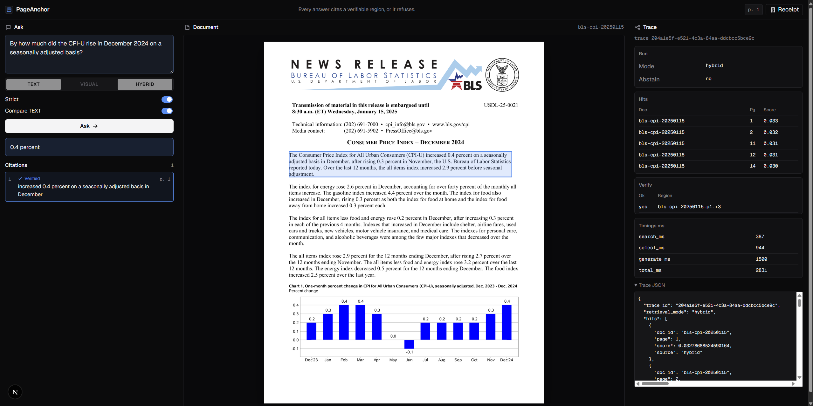
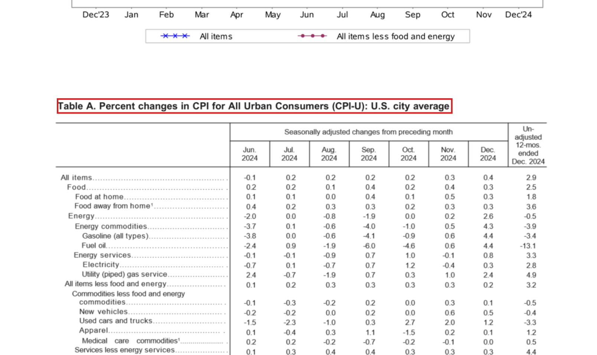

# PageAnchor

**Every answer cites a verifiable region on a page, or it refuses.**

Text-only RAG is fluent and uncheckable on layout-heavy PDFs. PageAnchor retrieves pages, picks layout regions, asks the generator for verbatim quotes, and keeps the answer only if each quote is a normalized substring of the cited region and the answer is a normalized substring of a cited quote. Web, CLI, MCP, and eval call the same `grounded_answer` function.





Code is Apache-2.0. Per-document licenses: [corpus/LICENSE.md](corpus/LICENSE.md). PDFs are not in git; SHA-256 in `corpus/manifest.json` is the source of truth.

## Layout

```
apps/web (Next.js)  →  HTTP  →  pageanchor.api (FastAPI)
                                      │
CLI / eval / MCP  ─────────────────────►  pageanchor.{ingest,retrieve,ground}
                                      │
                                      ▼
                         pages PNG | regions JSON | LanceDB
```

LanceDB is a directory (`LANCEDB_URI`, default `./corpus/lancedb`). There is no vector-database container. Default ask mode is `hybrid` (RRF of text + visual pages). Overlay draws `Citation.bbox` on the ingested PNG.

Details: [docs/ARCHITECTURE.md](docs/ARCHITECTURE.md) · [docs/API.md](docs/API.md) · [docs/MCP.md](docs/MCP.md) · [docs/EVAL.md](docs/EVAL.md)

## Run

Python 3.11+ and [uv](https://docs.astral.sh/uv/).

```bash
uv sync --extra dev --extra api --extra mcp
cp .env.example .env   # set DEEPSEEK_API_KEY
uv run pytest
uv run ruff check .
```

Visual retrieve needs torch + ColQwen2. `uv sync` replaces extras, so list every extra you need:

```bash
uv sync --extra dev --extra api --extra mcp --extra visual
```

NVIDIA GPU: PyPI torch is CPU-only on Windows. Overlay CUDA 12.8 wheels after the visual extra (latest on that index is 2.11.0, not 2.13):

```bash
uv pip install torch torchvision --index-url https://download.pytorch.org/whl/cu128
```

Use `uv run --no-sync` after that. A normal `uv sync` / `uv run` puts CPU torch back from the lock. ColQwen2 and the text embedder use CUDA when `torch.cuda.is_available()`. Force CPU with `PAGEANCHOR_DEVICE=cpu`. If you set `PAGEANCHOR_DEVICE=cuda` and torch is CPU-only, it fails fast with that install line.

### Corpus

```bash
uv run pageanchor ingest --all
uv run pageanchor ask "What is the title of Table A in the January 2025 CPI release?" --mode text
```

`ingest --all` is idempotent: the same PDF hash with existing pages, regions, and LanceDB rows is skipped.

Visual retrieve: `uv sync --extra visual` then `pageanchor ingest --visual --all`. After that, `--mode hybrid` is the default production path. `--visual` fills `pageanchor_visual`; re-running skips docs already indexed.

If Docling or ColQwen2 is painful on Windows:

```bash
docker compose --profile ingest up
docker compose --profile ingest run --rm ingest bash -lc \
  "uv sync --extra ingest --extra visual && uv run pageanchor ingest --visual --all"
```

CI runs pytest and ruff only. It does not download the corpus or GPU models.

### Overlay

```bash
docker compose up api
# or: uv run --no-sync --extra api python -m uvicorn pageanchor.api.main:app --reload --port 8000
```

```bash
cd apps/web && npm install && npm run dev
```

Open http://localhost:3000. The browser talks only to `http://localhost:8000` (CORS is that origin). Override with `NEXT_PUBLIC_API_URL`. If the visual table is missing, set the UI mode to `text`.

Need a GPU or a DeepSeek key to demo live answers. Without them you can still read this README, the eval table, and the overlay screenshot.

### MCP

Stdio. Cursor config: [`.cursor/mcp.json`](.cursor/mcp.json) (`${workspaceFolder}`, no API keys). `DEEPSEEK_API_KEY` stays in `.env`.

```json
{
  "mcpServers": {
    "pageanchor": {
      "command": "uv",
      "args": ["--directory", "${workspaceFolder}", "run", "--extra", "mcp", "python", "-m", "pageanchor.mcp.server"],
      "env": {
        "PAGEANCHOR_CORPUS_ROOT": "${workspaceFolder}/corpus",
        "LANCEDB_URI": "${workspaceFolder}/corpus/lancedb"
      }
    }
  }
}
```

Do not state a fact until `verify_quote` is true. Do not guess page content; call `select_evidence`. Full tool list: [docs/MCP.md](docs/MCP.md).

## Eval

Frozen gold: 30 questions (6 each of plain text, table, figure, layout, unanswerable), `frozen_at=2026-09-08`.

Committed run (`eval/results/2026-09-10/`, Windows CPU, ColQwen2 CPU, `deepseek-v4-flash`):

| system | recall@5 | citation page hit | verify pass | abstain P | abstain R | p50 ms |
| --- | ---: | ---: | ---: | ---: | ---: | ---: |
| A text | 0.708 | 0.917 | 0.917 | 0.333 | 1.000 | 1819 |
| B visual | 0.875 | 0.923 | 1.000 | 0.353 | 1.000 | 2104 |
| C hybrid | 0.875 | 0.923 | 1.000 | 0.353 | 1.000 | 2675 |
| D hybrid+verify | 0.875 | 0.923 | 1.000 | 0.353 | 1.000 | 2675 |
| D-lite text+verify | 0.708 | 0.917 | 1.000 | 0.316 | 1.000 | 1819 |

Visual retrieve lifts Recall@5 from 17/24 to 21/24. Hybrid matches visual on this freeze (RRF did not add another hit). D's verify pass equals C, so the strict path is not dropping good citations. D-lite catches the one unverified text quote (A 0.917 → 1.000). Abstain recall is 1.0 on the six unanswerable items. Precision is ~0.35 because the generator also refused about half of the answerable rows. Strict mode also requires the answer string to appear in a cited quote; a heading box is not enough.

Same gold on CUDA (`eval/results/2026-09-10-gpu/`, `torch 2.11.0+cu128`, RTX 4070 Ti SUPER). Recall@5 matches the CPU table. p50 drops because query encoding is on GPU; MaxSim stays numpy on CPU. Citation page hit can still move with the generator.

| system | recall@5 | citation page hit | verify pass | abstain P | abstain R | p50 ms |
| --- | ---: | ---: | ---: | ---: | ---: | ---: |
| A text | 0.708 | 0.909 | 1.000 | 0.316 | 1.000 | 1346 |
| B visual | 0.875 | 0.917 | 1.000 | 0.333 | 1.000 | 1503 |
| C hybrid | 0.875 | 0.846 | 1.000 | 0.353 | 1.000 | 1486 |
| D hybrid+verify | 0.875 | 0.846 | 1.000 | 0.353 | 1.000 | 1486 |
| D-lite text+verify | 0.708 | 0.909 | 1.000 | 0.316 | 1.000 | 1346 |

Visual wins on the LayoutLMv3 teaser (**q017**): text cited page 2 with an unverified quote; visual and hybrid cited the page 1 figure, verified. Visual does not fix ColPali Table 2 (**q012**, gold page 7): it cites a later restatement. The Roman first-slide title (**q016**) is retrieved by no mode. Full write-up: [docs/EVAL.md](docs/EVAL.md).

Hard set (`corpus/eval/hard_questions.jsonl`, 12 answerable + 4 adversarial unanswerable). Committed run `eval/results/2026-09-11-hard/`, CUDA, `torch 2.11.0+cu128`, RTX 4070 Ti SUPER, `deepseek-v4-flash`. Not mixed into the frozen-30 folders.

| system | recall@5 | citation page hit | verify pass | abstain P | abstain R | p50 ms |
| --- | ---: | ---: | ---: | ---: | ---: | ---: |
| A text | 0.417 | 0.333 | 1.000 | 0.400 | 0.500 | 2043 |
| B visual | 0.583 | 0.375 | 1.000 | 0.333 | 0.500 | 2315 |
| C hybrid | 0.583 | 0.375 | 1.000 | 0.333 | 0.500 | 2416 |
| D hybrid+verify | 0.583 | 0.375 | 1.000 | 0.333 | 0.500 | 2416 |

| system | region hit | answer match | quote support |
| --- | ---: | ---: | ---: |
| A text | 0.417 | 0.667 | 1.000 |
| B visual | 0.417 | 0.750 | 1.000 |
| C hybrid | 0.417 | 0.750 | 1.000 |
| D hybrid+verify | 0.417 | 0.750 | 1.000 |

Visual lifts Recall@5 from 5/12 to 7/12. Region hit stays 5/12: the gold span often never reaches the generator. Kept answers are extractive (`quote support` 1.0). Abstain recall is 2/4 on the adversarial rows. Wrong-page cites (h001 PaliGemma restatement, h007 nDCG@5 on page 21) are in `eval/results/2026-09-11-hard/report.md`.

```bash
uv sync --extra dev --extra visual
uv run pageanchor eval --gold corpus/eval/gold_questions.jsonl \
  --modes text,visual,hybrid,hybrid+verify,text+verify --out eval/results/$(date +%F)
```

GPU eval (same harness, separate folder). Overlay CUDA torch first:

```bash
uv pip install torch torchvision --index-url https://download.pytorch.org/whl/cu128
uv run --no-sync pageanchor eval --gold corpus/eval/gold_questions.jsonl \
  --modes text,visual,hybrid,hybrid+verify,text+verify --out eval/results/$(date +%F)-gpu
```

## Stack

- Generator: DeepSeek V4 (`deepseek-v4-flash`) via the OpenAI SDK at `https://api.deepseek.com`
- Text retrieve: `Qwen/Qwen3-Embedding-0.6B` (sentence-transformers)
- Visual retrieve: `vidore/colqwen2-v1.0` (ColQwen2), page MaxSim
- Layout: PyMuPDF (default) or Docling
- Web: Next.js 15, PNG overlay (not PDF.js)

## Not v1

User upload, auth, multi-tenant, chat history, SSE MCP, Kubernetes, HF Space, ColPali fine-tune, generator retry, IoU vs hand-drawn boxes, crawling.

## Write-up

Outline for a portfolio post (not in this repo):

1. Why fluent RAG is uncheckable on tables and slides
2. One `GroundedAnswer` behind CLI, HTTP, and MCP
3. Ablation table, the q017 visual win, and the q012 table miss ([docs/EVAL.md](docs/EVAL.md))
4. Overlay screenshot above
5. What we refused to build
